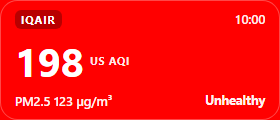

# KL Air Quality Index — Desktop Overlay

[](LICENSE)


A tiny always-on-top Windows widget that shows the live **US AQI for Kuala Lumpur** — no API
key, no account, no browser tab. Data is read from IQAir's public page and refreshed every
10 minutes, with automatic fallbacks if the page is rate-limited.

## ⬇ Download

[](https://github.com/andrewung2009/KL-Air-Quality-Index/releases/latest/download/KL-AQI.exe)

**[⬇ KL-AQI.exe](https://github.com/andrewung2009/KL-Air-Quality-Index/releases/latest/download/KL-AQI.exe)** — ~80 MB, Windows 10/11 x64

Double-click it — that's it. The widget opens immediately; the first run silently installs
to `%LOCALAPPDATA%\KL AQI` and creates **Desktop** and **auto-start** shortcuts. No admin
rights, no wizard, no dependencies.

**Updating** — just run the new `KL-AQI.exe`: it stops the running copy and replaces the
installed files in place. Your settings and cached reading live in `%APPDATA%\aqi-overlay`
and are left alone.

> Unsigned build — if Windows SmartScreen appears, choose *More info → Run anyway*.



## Features

- **Always on top** — pinned to a screen corner (all four corners supported), draggable, frameless 224×96 card
- **Live US AQI + PM2.5** with colour-coded category (Good → Hazardous) and local time
- **Today's high / low** — a compact `▲85 ▼42` chip next to the reading, from Open-Meteo's 24h forecast
- **In-app settings** — right-click → *Settings…* to edit the source URL, coordinates, time zone,
  refresh cadence, layout, notifications and auto-start; changes are validated and applied live
- **Notifications** — a Windows toast when the AQI category changes (optionally when it crosses
  a threshold you set); clicking the toast brings the widget forward
- **No API key** — scrapes the IQAir observation from the public page's structured data
- **Resilient fetch chain** — IQAir → jina reader proxy → Open-Meteo (clearly labelled `est.`),
  bounded by a 90-second deadline and a circuit breaker that stops hammering a blocked source
- **Works offline** — the last reading is cached and re-shown on restart with a live age badge (`42m`, `2h 05m`)
- **Wakes with the machine** — refreshes immediately after sleep/resume and re-anchors when displays change
- **System tray icon** — left-click hides/shows, right-click menu has the live reading, *Refresh now*,
  click-through, position corner and refresh interval
- **Hotkeys** — toggle visibility, toggle click-through, force refresh (work even while hidden)
- **Remembers state** — visibility, click-through, position and cached reading survive restarts
- **Single instance** — relaunching shows the existing widget instead of a second copy
- **Optional auto-start** — drop the shortcut into `shell:startup`

## Quick start

Requirements: **Node.js ≥ 18** (uses built-in `fetch`) and Windows.

```bash
git clone https://github.com/andrewung2009/KL-Air-Quality-Index.git
cd KL-Air-Quality-Index
npm install
npm start
```

Sanity-check the sources and the data pipeline:

```bash
npm run check     # syntax-check every source file
npm run test:fetch
```

## Hotkeys

| Shortcut | Action |
| --- | --- |
| `Ctrl+Alt+H` | Hide / show the widget (works even while hidden) |
| `Ctrl+Alt+A` | Toggle click-through (mouse passes to windows underneath) |
| `Ctrl+Alt+R` | Refresh now |

Right-clicking the widget opens a menu (Refresh, Hide, click-through, **Settings…**, Quit), and
the tray icon offers the same controls plus position/interval pickers, a **Notifications on/off**
toggle and the current reading. Left-clicking the tray icon hides or shows the widget.

## Settings window

**Settings…** (tray or widget right-click) opens a form that edits `config.json` for you — no
hand-editing required:

- **Data source** — IQAir page URL, fallback coordinates, IANA time zone, fallback sources toggle
- **Refresh** — interval, staleness threshold, high/low chip on/off
- **Layout** — anchor corner, inset, card width/height (applied live, no restart)
- **Notifications** — category-change toasts plus an optional `notifyAbove` threshold
- **Start automatically** — installed app only; creates/removes the startup entry

Values are validated with the same rules as a hand-edited `config.json`; anything out of range
falls back to the default and is reported inline. Position and refresh-interval changes are also
written to `state.json`'s `overrides`, so they keep winning over the file afterwards (delete
`state.json` to go back to the file's values).

Category-change notifications are **on** by default: the first reading after launch only sets a
baseline (no toast at startup), then every later category change notifies. `notifyAbove` defaults
to `0` (off).

## Data sources

The fetcher tries each source in order until one succeeds (3 attempts with jittered backoff
on the first source), all inside a **90-second budget** so a hung request can never stall the
widget. After 3 consecutive primary failures the IQAir source is skipped for 30 minutes
(circuit breaker) and the fallbacks are tried first — a manual refresh bypasses it:

1. **IQAir page** (primary) — parses the `ld+json` `Observation` node for US AQI and PM2.5.
   Detected and skipped when IQAir returns `429` or its bot-challenge page.
2. **`r.jina.ai` reader** — fetches the same page through a text-extraction proxy.
3. **Open-Meteo Air Quality API** — modelled estimate for the coordinates in `config.json`,
   shown with an `est.` badge so you always know when the number is not a measurement.

Failures are reported as short labels (`no network`, `rate limited`, `site blocked us`, …)
with the full diagnostic available on hover.

Categories follow the **US AQI** breakpoints (Good 0–50 → Hazardous 301+), each with its
standard colour and an accessibility-safe text contrast.

## Configuration

Edit `config.json` (restart to apply):

| Key | Default | Meaning |
| --- | --- | --- |
| `url` | IQAir Kuala Lumpur | Page to read |
| `latitude` / `longitude` | `3.139` / `101.6869` | Coordinates used by the Open-Meteo fallback |
| `refreshMinutes` | `10` | Refresh cadence |
| `staleMinutes` | `20` | After this, the reading is flagged stale |
| `position` | `bottom-right` | Anchor corner: `bottom-right`, `top-right`, `bottom-left`, `top-left` |
| `inset` | `16` | Distance from the screen edge (px) |
| `width` / `height` | `224` / `96` | Widget size |
| `timeZone` | `Asia/Kuala_Lumpur` | Timestamps shown in this zone |
| `fallbacks` | `true` | Enable the jina / Open-Meteo chain |
| `clickThrough` | `false` | Start in click-through mode |
| `transparent` / `focusable` | `false` / `true` | Window rendering options |
| `notifications` | `true` | Toast when the AQI category changes |
| `notifyAbove` | `0` | Also toast at or above this AQI (`0` = off) |
| `forecast` | `true` | Show today's high/low chip on the card |

Prefer the UI? **Settings…** in the tray menu or widget right-click edits these for you.

Malformed or out-of-range values fall back to their defaults instead of crashing the app —
the warning is written to the log.

### Runtime state

Visibility, click-through, position, refresh interval and the cached reading live in
`state.json` inside the user data folder (`%APPDATA%\aqi-overlay\state.json`; a copy beside
the exe is migrated on first run). Values under `overrides` there take precedence over
`config.json`, so tray-made changes win — delete `state.json` to go back to your config file.

Timestamped logs are appended to `%APPDATA%\aqi-overlay\app.log`.

## Building the standalone Windows app

The easiest way is to grab the prebuilt **[KL-AQI.exe](https://github.com/andrewung2009/KL-Air-Quality-Index/releases/latest/download/KL-AQI.exe)**
from the [Releases](../../releases) page. To rebuild it from source you need
[NSIS](https://nsis.sourceforge.io/) (winget: `winget install NSIS.NSIS`):

```bash
npm install
npm run dist     # syntax-check, stage payload\, compile dist\KL-AQI.exe
```

`scripts/build.js` copies the Electron runtime from `node_modules/electron/dist` into
`payload\`, drops `default_app.asar`, adds the app files (including `defaults.js`),
renames `electron.exe` to `KL AQI.exe`, then compiles `packaging/installer.nsi`. The
version stamped into the exe always comes from `package.json`.

Releases are automated: pushing a `v*` tag runs `.github/workflows/release.yml`, which
performs the same build on a clean runner and attaches `KL-AQI.exe` plus its SHA-256 to
a new GitHub release.

> Note: `electron-packager` currently fails silently on Node 26 (its `extract-zip` dependency
> dies mid-extraction), which is why the payload + NSIS flow is used.

## Project structure

```
aqi-overlay/
├── main.js          # BrowserWindow, tray, scheduler, hotkeys, IPC, state
├── defaults.js      # Config defaults, loading, validation, overrides
├── fetcher.js       # 3-source fetch chain + 24h forecast + AQI classification
├── renderer.js      # DOM updates for ok / loading / error / stale states
├── preload.js       # Context-isolated bridge (onUpdate, getState, settings)
├── settings.html    # Settings window markup
├── settings.js      # Settings window form logic
├── settings.css     # Settings window styles
├── index.html       # Widget markup
├── styles.css       # Colour-coded card layout
├── config.json      # User configuration
├── scripts/
│   └── build.js     # npm run dist: stage payload + compile the NSIS installer
├── .github/workflows/
│   └── release.yml  # tag push → build KL-AQI.exe → publish the release
├── packaging/
│   └── installer.nsi # NSIS script for the one-click KL-AQI.exe release
├── debug_capture.js # Offscreen renderer → assets/screenshot.png
├── icon.ico         # App icon (multi-size, PNG-compressed)
└── tray.png         # 16×16 tray icon
```

## License

[MIT](LICENSE) © 2026 andrewung2009
